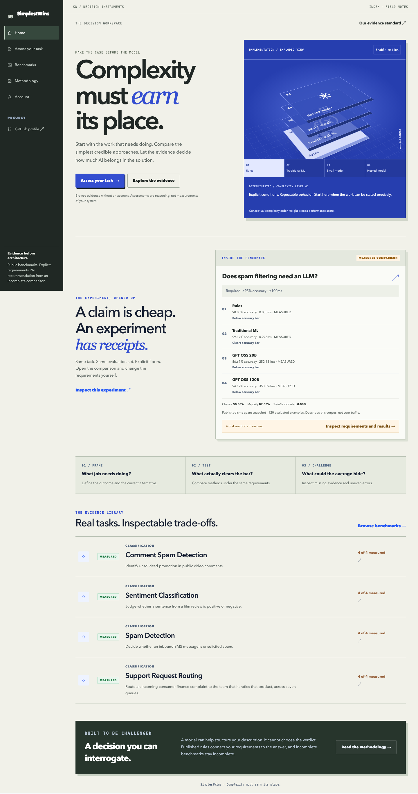
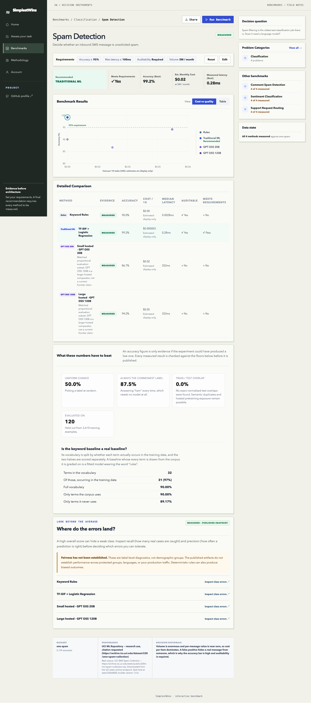

# SimplyWins

### Complexity must earn its place.

A decision workspace for choosing the simplest technical approach that meets the job: rules, traditional machine learning, or a hosted language model.

**[Explore the live product](https://simply-wins.vercel.app)** · **[Inspect the benchmark evidence](BENCHMARKS.md)** · **[Download results](benchmark-results.csv)** · **[Release status](STATUS.md)**

## Start with the decision

Teams often choose a model before defining the problem. SimplyWins reverses that sequence: describe the work, set quality and operating requirements, then compare measured approaches. A model can help structure a task description; explicit rules determine the recommendation.

## Product walkthrough

1. Open **Assess your task** and use the key-free questionnaire.
2. Explore the benchmark library: every published task has **4 of 4 methods measured**.
3. Change requirements and inspect which methods still qualify.
4. Review evidence floors, class errors, uncertainty, dataset provenance, and cost assumptions.

The interface uses an interactive exploded 3D method stack, layered editorial layouts, responsive navigation, keyboard controls, and reduced-motion support.

## What makes the decision inspectable

- Matched evaluation samples across every method in a comparison.
- Deterministic scoring against labels, rather than an LLM grading itself.
- Explicit incomplete-evidence and no-passing-method states.
- Chance, majority-class, and exact train/test overlap floors alongside accuracy.
- Estimated costs visibly separated from measurements and excluded from ranking.
- Private experiments separated from the published evidence catalogue.

## Release scope

The public evidence explorer is live. All published benchmark records were verified against saved predictions on September 7, 2026. The full local CI suite passed, and both hosted models passed fresh adapter connectivity checks. Production account sign-in still requires deployment configuration; the complete signed-in private experiment journey has not been verified. See [status and remaining work](STATUS.md).

## About this repository

This is a public product showcase by [Parth Dave](https://parthdave.me). It contains product screenshots, original explanatory documentation, and aggregate benchmark results. Application source, infrastructure configuration, private research notes, meeting content, credentials, and implementation history are not included. The implementation repository remains private.

The code and product are not offered under an open-source license. Third-party datasets and referenced research retain their own terms.
