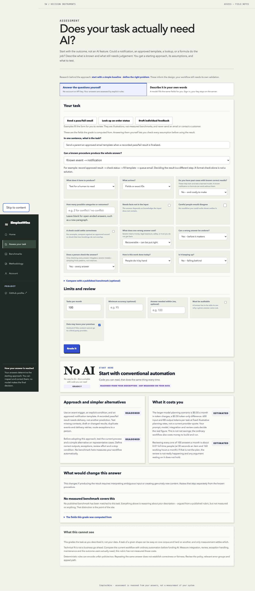

# SimplyWins

### Complexity must earn its place.

Does this job need AI at all? Compare your current process with notifications, templates, exact lookups, formulas, and learned methods. Get a starting approach, its assumptions, and what to test.

**[Explore the live product](https://simply-wins.vercel.app)** · **[Inspect the benchmark evidence](BENCHMARKS.md)** · **[Download results](benchmark-results.csv)** · **[Release status](STATUS.md)**

## What the product actually does

“Email a parent when their child passes” does not need AI if an approved result
is already recorded. A condition, template and delivery queue can handle it.
Judging an essay is a separate task. SimplyWins helps identify the distinction;
it does not send emails or make decisions about children.

**[Try the notification example](https://simply-wins.vercel.app/assess.html?example=notification)** · **[Purpose and validation](WHAT_IT_DOES.md)**

## Start with the decision

Teams often choose a model before defining the problem. SimplyWins reverses that sequence: describe the work, set quality and operating requirements, then compare measured approaches. A model can help structure a task description; explicit rules produce a provisional assessment. Only complete measured comparisons can support a benchmark recommendation.

## Product walkthrough

1. Open **Assess your task** and use the key-free questionnaire.
2. Explore the benchmark library: every published task has **4 of 4 methods measured**.
3. Change requirements and inspect which methods still qualify.
4. Review evidence floors, class errors, uncertainty, dataset provenance, and cost assumptions.

The interface uses an interactive exploded 3D method stack, layered editorial layouts, responsive navigation, keyboard controls, and reduced-motion support.

## What makes the decision inspectable

- Matched evaluation samples across every method in a comparison.
- Deterministic scoring against labels, rather than an LLM grading itself.
- Explicit incomplete-evidence and no-passing-method states.
- Chance, majority-class, and exact train/test overlap floors alongside accuracy.
- Estimated costs visibly separated from measurements and excluded from ranking.
- Private experiments separated from the published evidence catalogue.
- Optional model-assisted intake names the provider and model that filled the
  fields; the deterministic rubric still produces the verdict.
- Groq, OpenAI, Anthropic, Moonshot and Kimi Code credentials are identified
  separately, encrypted server-side and never returned to the browser.

## Release scope

The public evidence explorer and signed-in assessment path are live. All
published benchmark records were verified against saved predictions. On
September 11, 2026, a fresh production-browser test signed in, stored a Groq
credential through the encrypted server vault, and completed a Groq-assisted
notification assessment. The model filled a correctable task profile; the
published rubric independently returned **No AI — start with conventional
automation**. A Kimi Code credential authenticated successfully but could not
run inference because its account had reached its monthly quota. See [status
and remaining work](STATUS.md).

## About this repository

This is a public product showcase by [Parth Dave](https://parthdave.me). It contains product screenshots, original explanatory documentation, and aggregate benchmark results. Application source, infrastructure configuration, private research notes, meeting content, credentials, and implementation history are not included. The implementation repository remains private.

The code and product are not offered under an open-source license. Third-party datasets and referenced research retain their own terms.
